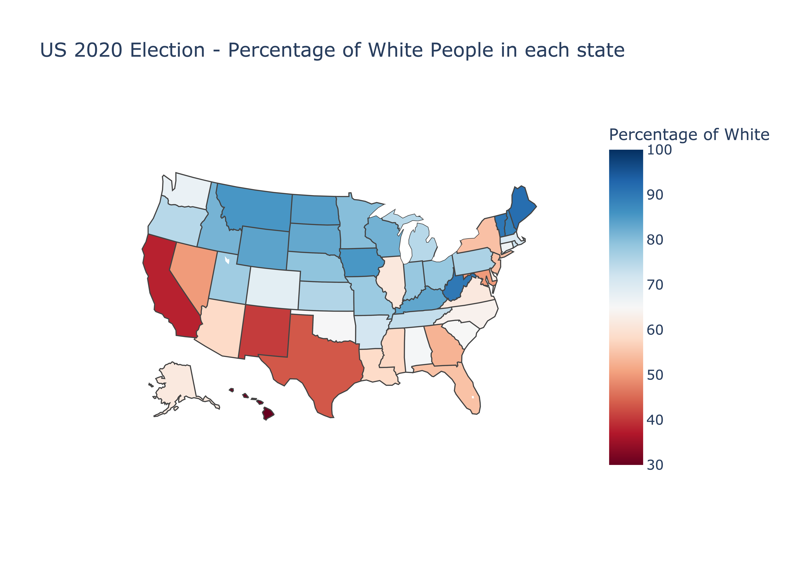

# DS105 Final Project 
**# US 2020 Elections: An Analysis of US Voting Habits Using Python**

## Motivation

The 2020 U.S. presidential election is undoubtedly a memorable one in history, with the highest national turnout rate since 1900 and the candidates with extreme contrasts. The two most promising candidates, Biden for the Democrats and Trump for the Republicans, stood on the completely reverse side of the political spectrum: left-wing liberalism vs. right-wing populism. Thus, it became a poll with no intermediate choices for over 10 million voters, who were far more ethnically and gender diverse than that presidential election a century ago.

<div  align="center"> 

</div>
<br/>
Not only did voters' diversity increase, but the availability of their information also increased over time. A variety of research and data regarding this election was generated across a wide variety of platforms and sites. Here, by integrating multiple data sets the US election results can be viewed by state, demographics or a wide variety of other variables. Analysing this data provides a unique opportunity to gain insights into the attitudes and opinions of the American public, as well as the factors that influenced the outcome of the election. For instance, the U.S census bureau has started to digitalize and publicize its periodic data since the new millennium. This allows the public to access the latest census data on ethnicity, income levels, etc. Since our group want to test the hypothesis that people would be uniformly influenced in their political choices by their identities and economic conditions, the 2020 U.S presidential election would be a desirable case to study: if the hypothesis is true, then people under similar condition will likely to vote the same candidate between two polarized choices. In addition, the analysis of data can also tell us the exact preference of people with different traits.

## Data Collection

Web scraping the data gave us hands-on experience in collecting and cleaning data, which is an essential skill in data analysis. These factors made the 2020 US Election an ideal choice for our coursework as we had to collect data from multiple sources. This coursework aims to analyse the 2020 US Election data by web scraping various sources and exploring various factors and variables that could have influenced the election outcome. The data collected could include demographic information, voting patterns, and opinion polls.

Once the data has been collected and analysed, we could use it to make predictions for the 2024 US Election. This coursework provides a valuable opportunity to apply data analysis and web scraping skills to a real-world example and gain insights into a major political event. The figure below shows the state by state breakdown and shape file that will be used to fit the data.

<div  align="center"> 

</div>
<br/>
There are 50 states in the USA. Each state has an associated number of votes as well as the demographics of the voters and the percentage of that state which voted in the election. The data was collected from two main sources. The figure below shows the two websites that data was collected from.

Politico Website with 2020 US Election Results by State | Statistical Atlas Site with Demographics by State
:-------------------------: | :-------------------------:
 | 

Politico, shown in the left hand figure, is the site where the voting data was scraped from. Statistical Atlas was used to collect all the demographic data for each state as well as general information about each state, such as their population. To collect the data, the general process was to import BeautifulSoup, a Python Web Scraping library, and then request the HTML content from the necessary site. From here, we found the relevant information on a given site and then produced the data as csv files. The example of how to do this with the Politico site can be seen below, while the Statistical Atlas case is given in the Python notebook.

```Python3
import requests
import csv
from bs4 import BeautifulSoup

url = "https://www.politico.com/election-results/2020/"
response = requests.get(url)
html = response.content

soup = BeautifulSoup(html, "html.parser")
election = soup.find("table", {"class": "table-body"})

results = []
for row in election.find_all("tr"):
    data = [i.text for i in row.find_all("td")]
    results.append(data)

with open("election.csv", "w", newline="") as f:
    writer = csv.writer(f)
    writer.writerows(results)
```

Web scraping the Politico site was relatively simple as the information on the page was limited and so we could effectively web scrape everything in one go. For the Statistical Atlas site however, some additional work needed to occur. The major issue came about from the data storing information on the page as zip codes as opposed to state by state information. This mean that we needed to aggregate information across the zip codes after assigning each zip code to one of the 50 states. We did this with the help of a library called uszipcode which had a preexisting database that we could access to assign values. The table below shows a small extract of the data that was collected as well as some of the key variables that are analysed later.

<details><summary> Table</summary>
<p>
    
|     state      | Trump Votes | Trump Percent | Biden Votes | Biden Percent | Median Household Income | All-age Poverty Rate | 2020 pop. |
|:--------------:|:-----------:|:-------------:|:-----------:|:-------------:|:-----------------------:|:--------------------:|:---------:|
| Alabama        |  1441170    |      62.2     |      849624 |          36.7 |                   53958 |                 14.9 |   5024279 |
| Alaska         |  189543     |      53.1     |      153502 |          43   |                   79961 |                  9.6 |    733391 |
| Arizona        |  1661686    |      49.1     |     1672143 |          49.4 |                   64652 |                 12.8 |   7151502 |
| Arkansas       |  760647     |      62.4     |      423932 |          34.8 |                   51146 |                 15.2 |   3011524 |
| California     |  5982194    |      34.3     |    11082293 |          63.5 |                   83001 |                 11.5 |  39538223 |
| Colorado       |  1364471    |      41.9     |     1804196 |          55.4 |                   77688 |                  9   |   5773714 |
| Connecticut    |  715291     |      39.2     |     1080680 |          59.3 |                   79723 |                  9.7 |   3605944 |
| Delaware       |  200603     |      39.8     |      296268 |          58.8 |                   71335 |                 10.9 |    989948 |
| Washington DC  |   18586     |      5.4      |      317323 |          93   |                   91957 |                 15   |    689545 |
| Florida        |  5668731    |      51.2     |     5297045 |          47.9 |                   61724 |                 12.4 |  21538187 |
| Georgia        |  2461837    |      49.3     |     2474507 |          49.5 |                   62800 |                 14   |  10711908 |
| Hawaii         |  196602     |      34.3     |      365802 |          63.7 |                   86878 |                  8.9 |   1455271 |
| Idaho          |  554128     |      63.9     |      287031 |          33.1 |                   62603 |                 10.1 |   1839106 |
| Illinois       |  2438943    |      40.5     |     3463260 |          57.6 |                   71243 |                 11   |  12812508 |
| Indiana        |  1729516    |      57.1     |     1242413 |          41   |                   60794 |                 11.6 |   6785528 |
| Iowa           |   897672    |      53.2     |      759061 |          45   |                   62362 |                 10.2 |   3190369 |
| Kansas         |   752933    |      56.5     |      551144 |          41.3 |                   63214 |                 10.6 |   2937880 |
| Kentucky       |   1326646   |      62.1     |      772474 |          36.2 |                   54074 |                 14.9 |   4505836 |
| Louisiana      |   1255776   |      58.5     |      856034 |          39.9 |                   51730 |                 17.8 |   4657757 |
| Maine          |   360480    |      44       |      434966 |          53.1 |                   59145 |                 10.6 |   1362359 |
| Maryland       |   976414    |      32.4     |     1985023 |          65.8 |                   88589 |                  9   |   6177224 |
| Massachusetts  |   1167202   |      32.3     |     2382202 |          65.9 |                   87288 |                  9.4 |   7029917 |
| Michigan       |   2649852   |      47.8     |     2804040 |          50.6 |                   61352 |                 12.6 |  10077331 |
| Minnesota      |   1484065   |      45.4     |     1717077 |          52.6 |                   75489 |                  8.3 |   5706494 |
| Mississippi    |   756789    |      57.6     |      539508 |          41.1 |                   47368 |                 18.7 |   2961279 |
| Missouri       |   1718282   |      56.8     |     1252902 |          41.4 |                   58812 |                 12.1 |   6154913 |
| Montana        |   343647    |      56.9     |      244836 |          40.6 |                   57730 |                 12.4 |   1084225 |
| Nebraska       |   556846    |      58.5     |      374583 |          39.4 |                   64735 |                  9.2 |   1961504 |
| Nevada         |   669890    |      47.7     |      703486 |          50.1 |                   64608 |                 12.5 |   3104614 |
| New Hampshire  |   365660    |      45.5     |      424935 |          52.9 |                   81415 |                  7   |   1377529 |
| New Jersey     |   1883260   |      41.4     |     2608327 |          57.3 |                   87095 |                  9.4 |   9288994 |
| New Mexico     |   401894    |      43.5     |      501614 |          54.3 |                   52285 |                 16.8 |   2117522 |
| New York       |   3039466   |      41.1     |     4248123 |          57.5 |                   73354 |                 12.7 |  20201249 |
| North Carolina |   2758775   |      50.1     |     2684292 |          48.7 |                   59616 |                 12.9 |  10439388 |
| North Dakota   |   235595    |      65.5     |      114902 |          31.9 |                   64289 |                 10.2 |    779094 |
| Ohio           |   3154834   |      53.3     |     2679165 |          45.3 |                   60360 |                 12.6 |  11799448 |
| Oklahoma       |   1020280   |      65.4     |      503890 |          32.3 |                   54512 |                 14.3 |   3959353 |
| Oregon         |   958448    |      40.7     |     1340383 |          56.9 |                   67832 |                 11   |   4237256 |
| Pennsylvania   |   3378263   |      48.8     |     3459923 |          50   |                   64898 |                 10.9 |  13002700 |
| Rhode Island   |   199922    |      38.8     |      307486 |          59.7 |                   73919 |                 10.6 |   1097379 |
| South Carolina |   1385103   |      55.1     |     1091541 |          43.4 |                   57216 |                 13.8 |   5118425 |
| South Dakota   |   261043    |      61.8     |      150471 |          35.6 |                   61149 |                 11.6 |    886667 |
| Tennessee      |   1849556   |      60.7     |     1139332 |          37.4 |                   56962 |                 13.6 |   6910840 |
| Texas          |   5890347   |      52.1     |     5259126 |          46.5 |                   66048 |                 13.4 |  29145505 |
| Utah           |   865140    |      58.2     |      560282 |          37.7 |                   77785 |                  7.3 |   3271616 |
| Vermont        |   112704    |      30.8     |      242820 |          66.4 |                   67717 |                  9.4 |    643077 |
| Virginia       |   1962430   |      44.2     |     2413568 |          54.4 |                   79154 |                  9.2 |   8631393 |
| Washington     |   1584651   |      39       |     2369612 |          58.4 |                   80319 |                  9.5 |   7705281 |
| West Virginia  |   545382    |      68.6     |      235984 |          29.7 |                   49202 |                 15.8 |   1793716 |
| Wisconsin      |   1610184   |      48.9     |     1630866 |          49.6 |                   64901 |                 10   |   5893718 |
| Wyoming        |   193559    |      70.4     |       73491 |          26.7 |                   67284 |                  9.2 |    576851 |
    
</p>
</details>
    
Alongside the data shown in this table, state-by-state breakdowns of ethnicity, educational attainment and median income for each state. Several other variables were initially explored though from many previous studies it has been shown these variables are the most often discussed when considering voter habits.

## Exploratory Data Analysis

Exploratory data analysis (EDA) is a crucial step in analysing our dataset as it helps us gain insight into the structure of our data. The goal of EDA is to summarise the characteristics of the data. In this coursework, we will perform EDA on the 2020 US Election data that we have web scraped. This will involve summarising the main characteristics of the data and creating various plots to visualise the relationships between variables.

An initial starting point is to consider basic summary statistics as shown in the table below.

<details><summary> Table</summary>
<p>
    
| Index   | Votes for Trump | Percentage Vote Trump | Votes for Biden | Percentage Vote Biden |   Median Household Income |   All-age Poverty Rate |   Percentage of Hispanic or Latino |   Percentage of White |   Percentage of Black or African American |   Percentage of American Indian and Alaska Native |   Percentage of Asian |   Percentage of Native Hawaiian and Other Pacific Islander | Percentage of Other Race |   Percentage of Population of Two or More Race | 2020 pop. |
|:--------|-----------------:|----------------:|-----------------:|----------------:|--------------------------:|-----------------------:|-----------------------------------:|----------------------:|------------------------------------------:|--------------------------------------------------:|----------------------:|-----------------------------------------------------------:|--------------------------------:|-----------------------------------------------:|-----------------:|
| Mean | 1450140 | 49.3588 | 1573090 | 48.6725 | 67123 | 11.6882 | 11.0294  | 68.1549 | 10.3686  |1.35098 | 4.58627 | 0.32549 | 0.417647 | 3.77059 | 6499010 |
| Standard Deviation | 1406660 | 11.9474 | 1880220 | 12.087 | 11394.2 | 2.61478 | 9.31258 | 15.3768 | 9.70209 | 2.56666 | 5.82237 | 1.28388 | 0.200705 | 2.21073 | 7408020 |
| Minimum | 18586 | 5.4 | 73491 | 26.7 | 47368 | 7 | 1.6 | 23.8 | 0.4 | 0.1 | 0.8 | 0 | 0.2 | 2.3 | 576851 |
| 25% | 473638 | 41.25 | 399258 | 40.25 | 59380.5 | 9.55 | 4.8 | 58.2 | 3.25 | 0.2 | 1.8 | 0 | 0.3 | 2.9 | 1816410 |
| 50% |  1020280 | 49.3 | 856034 | 49.4 | 64652 | 11 | 8.7 | 70.4 | 7.1 | 0.4 | 2.9 | 0.1 | 0.4 | 3.2 | 4505840 |
| 75% | 1789540 | 57.9 | 2375910 | 57.1 | 76588.5 | 13.15 | 12.6 | 79.6 | 13.55 | 0.9 | 5.15 | 0.1 | 0.5 | 3.8 | 7428390 |
| Maximum | 5982190 | 70.4 | 11082300 | 93 | 91957 | 18.7 | 44.3 | 91.7 | 38.9 | 13.5 | 39.6 | 9.1 | 1.2 | 17.3 | 39538200 |

    </p>
</details>

These summary statistics provide us with a general overview of the central tendency, variability, and distribution of the data across all 50 states. However, it is possible that the data may vary greatly between states, which can impact the election results. For example, some states may have a higher median household income, while others may have a higher poverty rate. Additionally, some states may have a higher percentage of certain races, such as a higher percentage of Hispanic or Latino, compared to others. Understanding the spread of these variables across states can provide insight into the diversity of the US population and the challenges faced by different communities. It is particularly interesting, that across the states Trump on average had a greater percentage of a given states votes than Biden. However, it makes more sense how Biden won when you consider that minimum percentages for Trump are much lower, 5.4%, compared to Biden, 26.7%. Moreover, the spread of median household income is clearly negatively correlated with the poverty rate within a given state. To further explore this variation, we create box plots and histograms for the variables and groups. These can be seen below.


The box plots show some insights. Firstly, there are certain states with particularly large or extreme numbers of votes for either Biden or Trump. On close inspection, it is unsurprising that certain states like Oklahoma and West Virginia where the votes for Trump where very high were these states. It is then also unsurprising that particularly large states that are known for being liberal, like California, are the anomalous results for the Biden Votes. From here, it is also worth looking at the correlation plot given in the figure below.

<div  align="center"> 

</div>
<br/>
The correlation plot suggests that voters with higher incomes tended to vote for the Republican candidate, Trump. Race and ethnicity also seems to have some impact on voting habits. Black and Hispanic voters have seemed more likely to vote for Biden, while White voters were more likely to vote with Trump than they were with Biden. It would be interesting to be able to analyse the spatial aspect of the data and see if there is any consistencies between states that voted for Trump.

## Findings

Lets first generate a plot using the shape file and data so we can easily visualise the voting habits of the election. This can be seen in the figure below.

<div  align="center"> 

</div>
<br/>
The plot here only shows the percentage that a given state voted for Biden. However, the implication here is relatively clear. States with a low percentage of Biden votes will clearly have a high percentage of Trump votes as in any given state the votes for the combined candidates is between 95.9% and 99.1%. It is unsurprising from this map, that states that are generally known for more conservative attitudes voted Republican and the more liberal states seemed to vote for Democratic candidates. States on the East and West coast generally voted in favour of Biden while the central and midwestern states more commonly voted in favour of Trump. It is now useful to substrata this data down further to see if other factors have similar mappings.

<div  align="center"> 

</div>

In the figure above, it can be seen the poverty rate, that is the percentage of people living below the poverty line, varies between approximately 7 and 19 percent. Here, it can be seen that Mississippi had the highest rate of poverty while New Hampshire had the lowest. If we compare this map to our previous Biden Percentage plot, it can be seen that particularly for extremely high rates of poverty this appear to be states that more strongly supported Trump, while States with low rates preferred Biden. However, the states with the more average rates of Poverty, between the 11-15 percent, did not have as clear a pattern.

<div  align="center"> 

</div>
This next figure shows more about the Median Household income. When compared to the voting habits of the general population, it is clear that this relates more so than the poverty rate. If you rescale both of these plots to be between 0 and 1, it is clear that State by State those with low median incomes have high percentage votes for Trump, while the higher median States, were more likely to vote for Biden. While not evident on these plots, this is somewhat surprising when we consider external data known about voters. Republicans tend to be the wealthiest and poorest of the electoral college while Democrats make up more of the middle class.

In the initial spatial maps, we analysed the Poverty rate and the median household income. We now want to further break down our analysis by also looking at how race also affects the voting habits of the US 2020 election.

| White | Hispanic | African American |
|:-----:|:--------:|:----------------:|
|  |  |  |

It is clear from these plots, which make up the three biggest ethnic groups in the US, that the White voters pattern is not immediately obvious. However, by looking at the Hispanic map, it is clear there is a similar mapping between Biden votes and states with higher percentages of Hispanic residents. Finally, in the case of African American voters, due to the low percentage in many states it is difficult to analyse. By transforming the data, it can be seen that this would show similar results to the Hispanic map. 

Given more time, it would have been useful to build plots that looked at educational attainment though it can be seen from data in general, that those who had higher levels of education, regardless of state, tended to be more likely to vote for Biden.

## Conclusion

In conclusion, our group has primarily attempted to investigate the factors that influenced voters’ choices in the 2020 U.S. presidential election. We chose income level and race as the target variables and state as the unit, extracting the data of median household income and poverty rate as the former one’s indicators and the data of the three most populous races: White, Hispanic or Latino and Black or African American as the latter one’s indicator. As the analysis displays, the variations in the poverty rate and the Hispanic/Latino population have the most matched patterns with the states’ voting outcome among the paralleled indicators: the higher percentage of Hispanic/Latino population and the lower the poverty rate in a state, the more likely it was to vote for the eventual winner, Biden of the Democratic Party.

Certainly, our investigation has its limitations and drawbacks, and there are methodological improvements that can be applied to its design. The state might not be the most appropriate unit for delineating the population, since inside the states there are multiple electoral districts where the population and living conditions differ drastically, but all of them are ultimately represented by a final choice tallied at the state level. The variation in median household income at the state level doesn’t much consistent with the variation in the candidate choices in our findings, but the correlation might be more obvious if we change the unit from state to electoral district, especially when districts are divided between urban and rural areas. Furthermore, the division according to electoral states can facilitate the investigation of other variables’ influence on voting choices, for instance, researching on the population’s average degree of education. Like the median household income, this variable’s rural-urban might be even greater than its state-to-state difference.

## Appendix
### Work Distribution: 
+ Nicolas Michel: Nicolas took care of most of the exploratory analysis and the findings. I took care of the creation of the plots and explained how each had an impact on our research. 
+ Xiran Fang:
+ Suosi He:
